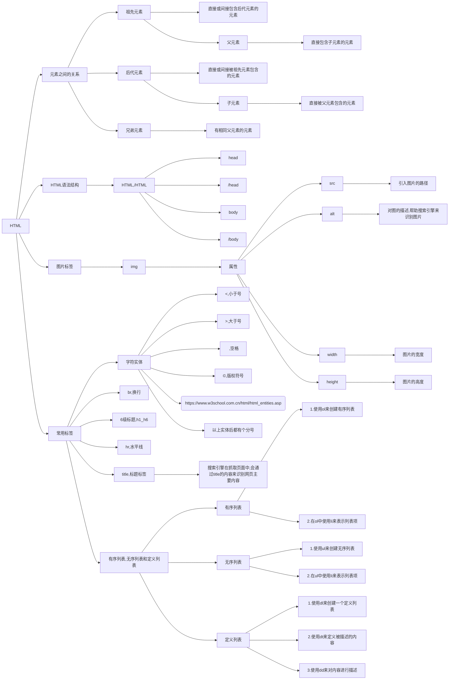
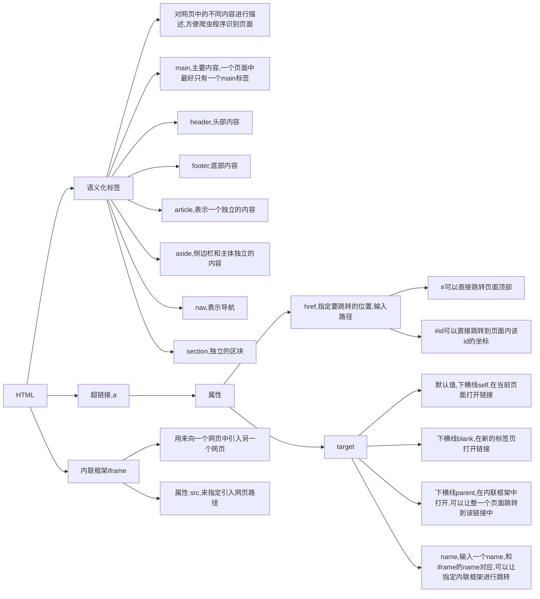
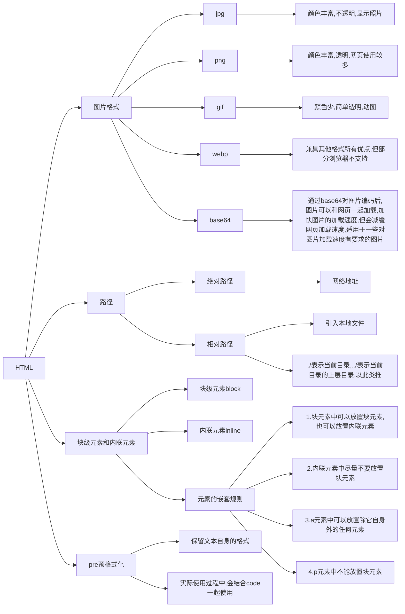

# **HTML**

1.对前端的发展有了基础的了解，万维网的发明者是<u>伯纳斯李</u>，初期网景公司和微软公司竞争，<u>W3C规范</u>(结构，表现和行为)，最后Google的Chrome打破了微软的垄断.hjkhkj

2.开始HTML学习，字符实体，HTML语法结构，元素之间的关系(父子元素，祖先元素和后代元素)，HTML常用标签，pre预格式化标签，语义化标签，图片标签.

3.图片格式(jpg,png,gif,webp,base64)，相对路径(../上层目录)，超链接(a,href)，内联框架(iframe)，块级元素和内联元素，元素的嵌套规则(块可套块和行，除p标签，行不可套块).

4.typora的流程图。语法解释：graph 关键字就是声明一张流程图，TD 表示的是方向，这里的含义是 Top-Down 由上至下。

5.常用MDN查询链接：1)[HTML的标签](https://developer.mozilla.org/en-US/docs/Web/HTML/Element)
    								   2)[字符实体](https://html.spec.whatwg.org/multipage/named-characters.html#named-character-references)

